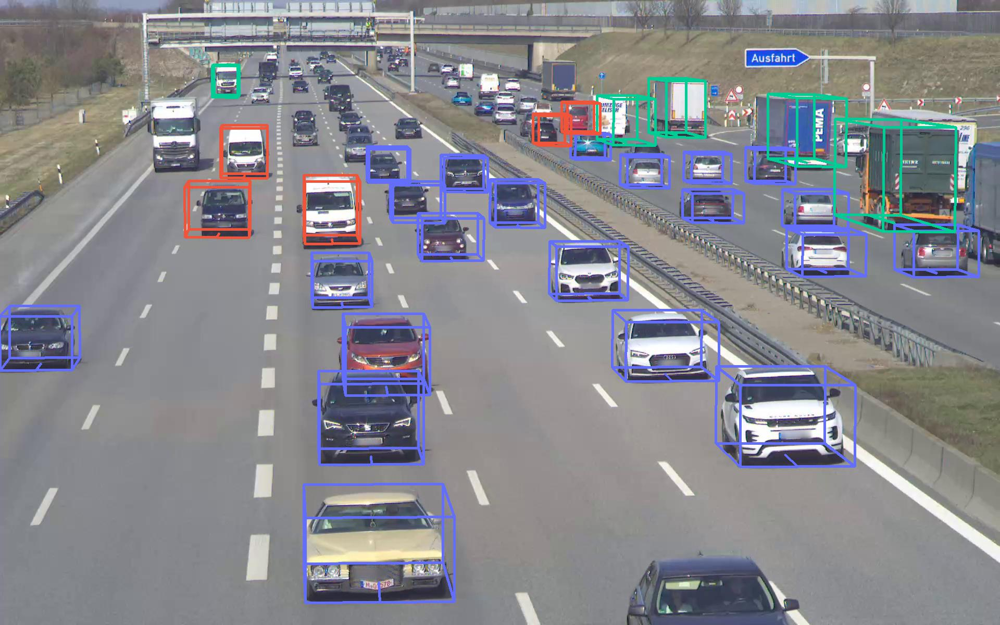

# Real-Time Monocular 3D Object Detection to Support Autonomous Driving

This is the code that supports my bachelor's thesis "Real-Time Monocular 3D Object Detection to Support Autonomous Driving". The PDF can be downloaded [here](https://syncandshare.lrz.de/getlink/fiEziVnJvvhhN2yyiRUDTUtk/thesis_leon_blumenthal.pdf) and a video of some results can be found [here](https://youtu.be/I9XxiKNIwYE).

## How to install
The code in this repository is written for Python 3.8. The full [requirements.txt](./requirements.txt) is only needed when using the Mask R-CNN ([Detectron2](https://github.com/facebookresearch/detectron2)) or [YolactEdge](https://github.com/haotian-liu/yolact_edge) models. Otherwise, the [requirements_eval.txt](./requirements_eval.txt) suffices (e.g. running the notebooks). If installing fails, look at the comments in the [requirements.txt](./requirements.txt).

## Src

The main Python code is in the [src/](./src/) directory. It includes utilities and two versions (CPU/GPU) of my working approach. 

## Scripts
The [scripts/](./scripts/) directory contains two scripts to create detections with the [YolactEdge](https://github.com/haotian-liu/yolact_edge) and Mask R-CNN ([Detectron2](https://github.com/facebookresearch/detectron2)) models or benchmark their FPS. They both depend on the full [requirements.txt](./requirements.txt) and should be executed from the main directory. The specific arguments are documented for each script.

## Notebooks

The [notebooks/](./notebooks/) produce evaluation results and figures in my thesis. They depend on the correct files in the [data/](./data/) directory, which can be downloaded [here](https://syncandshare.lrz.de/getlink/fiQq3fm3imbYs7TeYvvbpmAr/data.tar.gz). Some interactive outputs might not be visible in the web viewer.

Notebook | Content
--- | ---
[a9_r0_exploration.ipynb](notebooks/a9_r0_exploration.ipynb) | Exploration of the *A9-Dataset* from the *Providentia++* project
[approach.ipynb](notebooks/approach.ipynb) | Figures for the approach chapter
[fixed_angle.ipynb](notebooks/fixed_angle.ipynb) | Figures and results for the fixed orientaion section of the evaluation chapter
[instance_segmentation.ipynb](notebooks/instance_segmentation.ipynb) | Figures for the instance segmentation section of the evaluation chapter
[intersection.ipynb](notebooks/intersection.ipynb) | Figures for the dynamic orientation section of the future work chapter
[labels_fixing.ipynb](notebooks/labels_fixing.ipynb) | Quick and dirty way to fix the 3D bbox of labels
[video_creation.ipynb](notebooks/video_creation.ipynb) | Video creation for instance masks and 3D bboxes

